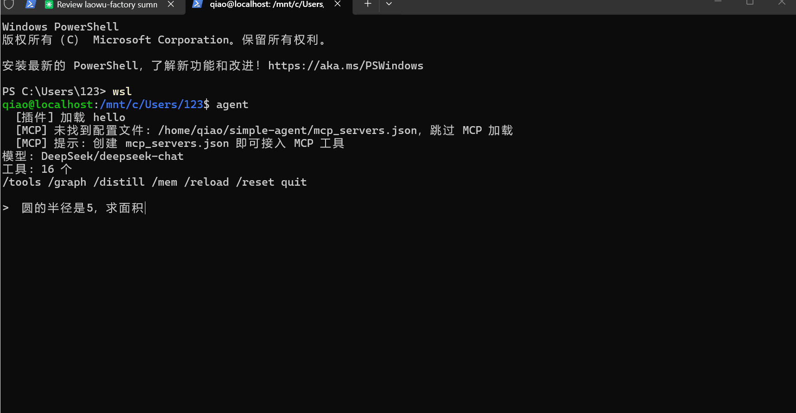

# Simple Agent

[](https://github.com/jm666-qwe/simple-agent/actions/workflows/test.yml)

> 从零构建的 AI Agent，14 个内置工具 + MCP 协议 + 知识图谱 + 插件热加载。  
> 两周从玩具到项目级，作为实习作品集的核心项目。



## 架构

```
simple-agent/
├── agent.py              # 主入口，CLI REPL
├── model.py              # 模型抽象层 (DeepSeek/通义千问/OpenAI)
├── tool_base.py          # 工具基类 + 注册表
├── tools.py              # 15 个内置工具
├── permissions.py        # 权限系统 (写/执行前确认)
├── memory.py             # 三级记忆 (对话/日级/核心) + 语义搜索
├── knowledge_graph.py    # 知识图谱 (实体关系提取 + HTML 可视化)
├── mcp_client.py         # MCP 协议客户端 (600+ 外部工具)
├── plugin_loader.py      # 插件热加载 (无需重启)
├── plugins/              # 插件目录 (.py 文件自动发现)
│   └── example.py        # 示例插件
├── run.sh                # WSL 启动脚本
├── agent_simple.py        # 教学版：100 行纯 ReAct 循环
└── requirements.txt

## 想理解 Agent 原理？

**先看 `agent_simple.py`**，100 行，单文件，只有核心循环 + 2 个工具。10 分钟读完就能复刻。

**再看 `agent.py`**，加上流式输出、权限、记忆、MCP——每个模块都是教学版的后一步。

**用 `--trace` 看运行过程**：
```bash
python3 agent.py --trace "圆的半径是5，求面积"
```
每一步清清楚楚：
```
[步骤1] LLM 推理 → 决定调用 calculate
[步骤2] 执行 calculate
[步骤3] calculate 返回: 78.53975
[步骤4] LLM 整合 → 生成最终回答
```
```

## 快速开始

```bash
# 0. 注册 DeepSeek API Key (50 万 token 免费)
#    https://platform.deepseek.com/api-keys

# 1. 一键安装
git clone https://github.com/jm666-qwe/simple-agent.git
cd simple-agent
bash setup.sh

# 2. 启动
python3 agent.py
```

## 内置工具 (15个)

| 工具 | 说明 |
|------|------|
| `calculate` | 安全数学计算（白名单 eval） |
| `get_weather` | 城市天气查询 (wttr.in) |
| `get_current_time` | 当前日期时间 |
| `search_web` | 联网搜索 (DuckDuckGo, 免费) |
| `read_url` | 网页内容提取 |
| `github_search` | GitHub 项目搜索 |
| `github_readme` | GitHub README 获取 |
| `run_command` | 安全 Shell 命令 (白名单) |
| `run_python` | 代码沙箱 (隔离执行) |
| `read_file` | 文件读取 |
| `write_file` | 文件写入 |
| `remember` | 保存记忆 |
| `recall` | 关键词搜索记忆 |
| `recall_semantic` | 语义搜索记忆 (LLM 精排) |
| `forget` | 删除记忆 |

## 命令

| 命令 | 功能 |
|------|------|
| `/tools` | 列出所有工具 |
| `/graph` | 生成知识图谱 HTML，浏览器打开 |
| `/distill` | LLM 蒸馏近期对话 → 日级摘要 |
| `/mem` | 查看三级记忆统计 |
| `/reload` | 热重载插件目录 |
| `/reset` | 清除对话断点 |
| `quit` | 退出（自动保存进度） |

## 特性

**流式输出** — 逐 token 打印，打字机效果

**权限系统** — `write_file` / `run_command` / `run_python` 执行前弹确认，支持 `--yes` 跳过

**三级记忆**
- 对话级 (episodic): 即时存储，关键词 + 时间衰减排序
- 日级 (daily): LLM 自动蒸馏对话要点
- 核心 (core): 长期用户画像，手动提升

**语义搜索** — 关键词初筛 → LLM 精排，比纯关键词准确

**MCP 协议** — 接入 600+ 外部工具生态。配置 `mcp_servers.json` 即可：
```json
{
  "mcpServers": {
    "fetch": {"command": "uvx", "args": ["mcp-server-fetch"]},
    "memory": {"command": "npx", "args": ["-y", "@modelcontextprotocol/server-memory"]}
  }
}
```

**插件热加载** — 在 `plugins/` 下创建 `.py` 文件，`/reload` 即可注册新工具，无需重启。

**知识图谱** — 从记忆自动提取实体关系，生成 Mermaid 可视化 HTML。

**断点恢复** — Ctrl+C 退出自动保存，下次启动可选择恢复。

## 技术栈

- Python 3.10+
- OpenAI 兼容 API (DeepSeek / DashScope / Qwen)
- MCP (Model Context Protocol) JSON-RPC
- DuckDuckGo Instant Answer API
- GitHub REST API
- Mermaid.js (知识图谱可视化)
